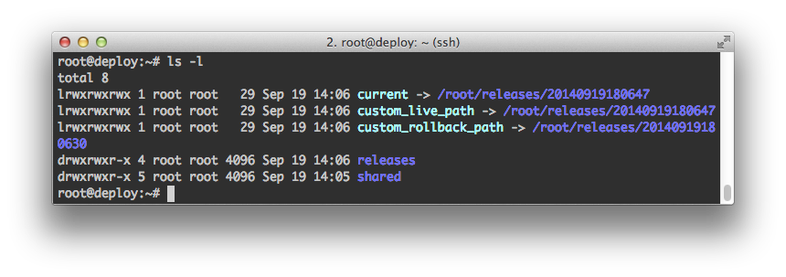

# Cap Blue Green Deploy    

Blue-Green deployment solution for Capistrano, using symbolic links between releases.

## Blue Green Concept

Learn more about
[Blue Green Deployment with Martin Fowler](http://martinfowler.com/bliki/BlueGreenDeployment.html)

## Introduction

**Cap Blue Green Deployment** is a non canonical Blue Green solution, based on symlinks. Instead of having **blue** and **green**, we have **pre** and **live**. Pre is always validation environment and live it's  production environment.

You can do as many deploys you need to **pre** without affecting the live env. Changing symlinks you can easily put your code from validation to production environment. 

## Prerequisite

  - Capistrano 2 (Capistrano 3 coming soon)

## Installation

Add this line to your application's Gemfile:

    gem 'cap_blue_green_deploy'

And then execute:

    $ bundle

Or install it yourself as:

    $ gem install cap_blue_green_deploy

And then, require the gem script under your capistrano configuration file (Capfile, deploy.rb, ...):

    require 'cap_blue_green_deploy'

## Usage

* **Going to Production** `cap deploy:blue_green:live`

  This command will change symlinks of `current_live` dir to keep the the same release path of `current` dir. And also create the `previous_live` symlink to track the last current live release used.

  **More explanations**

  If `current_live` already exists, the `previous_live` dir will be created/updated, copying the same symlink of `current live` release, to keep traking the last valid release.

  Finally, the command will create/update the `current_live` symlink, copying the same symlink of `current` release.

* **Rollbacking** `cap deploy:blue_green:rollback`

  This command will change the `current_live` symlink to use the same destination of `previous_live` symlink.

* **Cleanup** `cap deploy:blue_green:cleanup`

  This is the same behavior of the default capistrano cleanup `deploy:cleanup`, but the `current_live` and `previous_live` releases will be preserved and not removed.

  **This lib automatically rewrite the default deploy:cleanup to use this new cleanup function.**

  **Don't forget that you need to add the cleanup callback manually in your capistrano file:** `after "deploy:update", "deploy:cleanup"`

* **Custom Variables**

  You can change the default value setting new variable in your capistrano file. The default values is:
  - keep_releases: 5
  - blue_green_live_dir: "current_live"
  - blue_green_previous_dir: "previous_live"

## How to Play
**Custom Variables used**
- `set :keep_releases, 2`
- `set :blue_green_live_dir, "current_live"`
- `set :blue_green_previous_dir, "previous_live"`

**1. Starting with clean server**

**2. Running `cap deploy:setup` to prepare the server**

**3. Running `cap deploy` three times to populate the release folder (cleanup code removes one old release)**

**4. Going to live `cap deploy:blue_green:live` (current_live dir will be created. No changes in releases dir)**

**5. Running two more deploy with `cap deploy` (current_live will not change. Cleanup remove one old release.)**

**6. Going to live again with `cap deploy:blue_green:live` (At this time, previous_live will be created, targeting the current_live release before change it. No changes in releases dir)**

**7. Something goes wrong... Rollbacking with `cap deploy:blue_green:rollback` (The current_live will change to target the same release of previous_live. No changes in releases dir)**

**8. Running one more deploy with `cap deploy` (current_live and previous_live will not change. Cleanup remove one old release.)***

**9. Going to live again with `cap deploy:blue_green:live`**

**Changing current_live and previous_live variables to use custom names (custom_live_path, custom_rollback_path)**

## Contributing

1. Fork it
2. Create your feature branch (`git checkout -b my-new-feature`)
3. Commit your changes (`git commit -am 'Add some feature'`)
4. Push to the branch (`git push origin my-new-feature`)
5. Create new Pull Request
